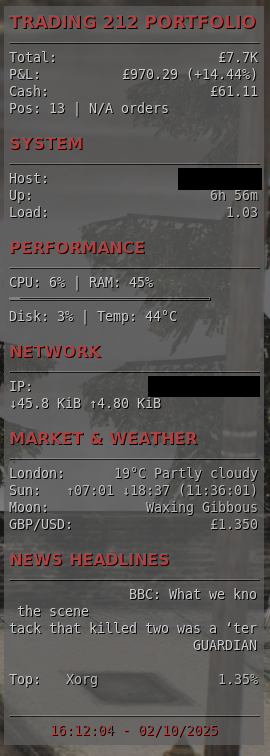

# Conky Trading Dashboard

A comprehensive conky configuration for trading, news, weather, and system monitoring with clean, portable setup.



## Features

This enhanced Conky configuration displays your Trading212 portfolio data alongside comprehensive system monitoring, weather information, and market data.

### 📈 Trading212 Portfolio
- **Total Portfolio Value** - Your complete portfolio worth
- **Profit & Loss (P&L)** - Current gains/losses with percentage
- **Free Cash** - Available cash balance
- **Invested Amount** - Total amount invested
- **Position Count** - Number of open positions
- **Pending Orders** - Number of pending trades
- **Top Position** - Your largest holding by value
- **API Status** - Connection status indicator

### 📰 Scrolling News Headlines
- 4 headlines displayed simultaneously
- Native conky horizontal scrolling for long titles
- Headlines refresh every 10-16 seconds (staggered)
- Multiple sources: BBC, Guardian, Sky News, Hacker News, TechCrunch

### 🌤️ Weather & Astronomy
- Current weather for your location
- Sunrise/sunset times and day length
- Moon phase information

### 💻 System Monitoring
- **Performance Metrics** - CPU usage, RAM, disk I/O, temperatures
- **Network Information** - Speed graphs, IP addresses, data usage
- **Process Monitoring** - Top CPU-consuming processes
- **Hardware Info** - CPU frequency, GPU temperature (NVIDIA)

### 💱 Market Data
- GBP/USD exchange rate
- Real-time market information
- Extensible for more currency pairs

## Quick Setup

1. **Copy the entire conky folder** to `~/.config/conky/`
2. **Run setup script**: `cd ~/.config/conky && ./setup.sh`
3. **Configure Trading212** (optional): Edit `trading212_config.json` with your API key
4. **Adjust location** (optional): Edit `config.json` for your location
5. **Start conky**: `conky -c ~/.config/conky/conky.conf`

## File Structure

```
~/.config/conky/
├── config.json              # 🔧 Main configuration (location, news sources, etc.)
├── conky.conf               # 🖥️  Conky display configuration  
├── trading212_config.json   # 💰 Trading212 API credentials
├── requirements.txt         # 📦 Python dependencies
├── setup.sh                 # 🚀 Automated setup script
├── news_simple.py           # 📰 Simple news headlines fetcher
├── sun_moon.py              # 🌅 Sunrise/sunset/moon phases
├── trading212_api.py        # 💹 Trading212 API integration
└── README.md               # 📖 This file
```

## Configuration

### Trading212 Setup

#### 1. Get API Credentials

1. Open the **Trading212 mobile app**
2. Go to **Settings** → **API**
3. Generate your **API Key** and **API Secret**
4. **Important**: Store these securely - they provide full account access

For detailed instructions, visit: [Trading212 API Key Guide](https://helpcentre.trading212.com/hc/en-us/articles/14584770928157-Trading-212-API-key)

#### 2. Configure API Keys

1. Edit the configuration file:
   ```bash
   nano ~/.config/conky/trading212_config.json
   ```

2. Replace the placeholder values:
   ```json
   {
     "api_key": "YOUR_ACTUAL_API_KEY_HERE",
     "api_secret": "YOUR_ACTUAL_API_SECRET_HERE",
     "update_interval": 300,
     "cache_duration": 60,
     "preferences": {
       "currency_symbol": "£",
       "show_percentages": true,
       "show_ticker_suffixes": false,
       "max_positions_display": 5
     }
   }
   ```

#### 3. Make Scripts Executable

```bash
chmod +x ~/.config/conky/trading212_api.py
```

#### 4. Test the Setup

Test the API connection:
```bash
cd ~/.config/conky/
python3 trading212_api.py status
```

Test individual data points:
```bash
python3 trading212_api.py total_value
python3 trading212_api.py total_ppl
python3 trading212_api.py free_cash
```

### Location Settings

Edit `config.json` to change location (affects weather, sunrise/sunset):

```json
"location": {
  "name": "London",
  "latitude": 51.5074,
  "longitude": -0.1278,
  "timezone_offset_hours": 1
}
```

### News Sources

Add/remove news sources in `config.json`:

```json
"news": {
  "sources": {
    "bbc": "http://feeds.bbci.co.uk/news/rss.xml",
    "guardian": "https://www.theguardian.com/uk/rss",
    "sky": "https://feeds.skynews.com/feeds/rss/home.xml",
    "hackernews": "https://hnrss.org/frontpage",
    "techcrunch": "https://techcrunch.com/feed/"
  }
}
```

### Scrolling Settings

The news headlines use conky's native `$scroll` function:
- **Width**: 35 characters display width
- **Speed**: 2 characters per update
- **Refresh**: Staggered every 10-16 seconds for smooth rotation

## Testing

Test individual components:

```bash
# Test news headlines
~/.config/.venv/bin/python ~/.config/conky/news_simple.py list

# Test single headline (for scrolling)
~/.config/.venv/bin/python ~/.config/conky/news_simple.py single 0

# Test sun/moon data
~/.config/.venv/bin/python ~/.config/conky/sun_moon.py all

# Test trading212 connection
~/.config/.venv/bin/python ~/.config/conky/trading212_api.py total_value
```

## Available Data Points

The `trading212_api.py` script supports these commands:
- `total_value` - Complete portfolio value
- `total_ppl` - Profit/loss with percentage and color coding
- `free_cash` - Available cash balance
- `invested` - Total invested amount
- `positions_count` - Number of open positions
- `pending_orders` - Number of pending orders
- `top_position` - Largest position by value
- `status` - API connection status

## Update Intervals

- **Trading212 Data**: 300 seconds (5 minutes)
- **News Headlines**: 10-16 seconds (staggered)
- **Weather**: 1800 seconds (30 minutes)  
- **Sun/Moon**: 3600 seconds (1 hour)
- **Currency**: 600 seconds (10 minutes)

## Customization

### Color Scheme
The Silent Hill aesthetic uses:
- `color1` (aa4444) - Rust red headers
- `color2` (888888) - Fog grey secondary text
- `color3` (666666) - Dark grey lines
- `color4` (cccccc) - Light grey labels
- `color5` (44aa44) - Profit green
- `color6` (dd4444) - Loss red

### Display Preferences
Edit `trading212_config.json` to customize:
- **currency_symbol**: Change display currency (£, $, €)
- **show_percentages**: Enable/disable percentage displays
- **max_positions_display**: Limit number of positions shown

## Backup & Restore

**To backup your setup:**
```bash
tar -czf conky-dashboard-backup.tar.gz ~/.config/conky/
```

**To restore on a new system:**
```bash
tar -xzf conky-dashboard-backup.tar.gz -C ~/
cd ~/.config/conky && ./setup.sh
```

## Troubleshooting

### Common Issues

- **News not loading**: Check internet connection, RSS feeds may be temporarily down
- **Scrolling issues**: Conky's native scrolling handles long headlines automatically
- **Trading212 errors**: Verify API key in `trading212_config.json`
- **Location issues**: Update coordinates in `config.json`
- **Python errors**: Run `./setup.sh` to reinstall dependencies

### Trading212 Specific

1. **"API Error" or "N/A" displayed**
   - Check your API credentials in `trading212_config.json`
   - Verify internet connection
   - Ensure Trading212 API is accessible

2. **Permission errors**
   - Make sure the script is executable: `chmod +x trading212_api.py`
   - Check file permissions on config file

3. **Python import errors**
   - Install requests: `pip3 install requests`
   - Use correct Python version: `python3` not `python`

### Rate Limiting
Trading212 API has rate limits:
- Portfolio data: 1 request per 5 seconds
- Account info: 1 request per 30 seconds
- Orders: 1 request per 5 seconds

The configuration respects these limits with appropriate update intervals.

## Security Notes

- **Never share your API credentials**
- **Use IP restrictions** in Trading212 settings if possible
- **Monitor API usage** through Trading212 dashboard
- **Revoke keys immediately** if compromised

## Support

For issues:
1. Check Trading212 API documentation: https://t212public-api-docs.redoc.ly/
2. Verify Conky configuration syntax
3. Test API script independently
4. Check system logs for errors

## API Limits & Beta Notes

- Trading212 API is currently in beta
- Live trading supports only Market Orders via API
- Rate limits are per-account regardless of API key used
- Some features may change during beta period

The configuration automatically handles API errors and displays fallback information when services are unavailable.